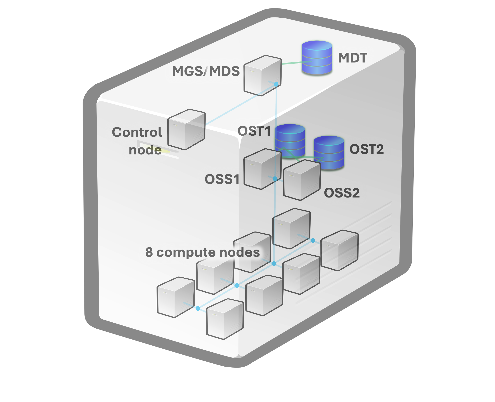
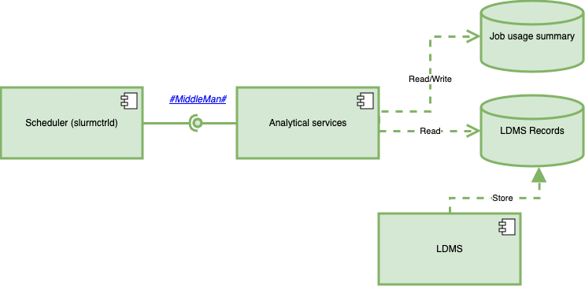

*************************************
#    Slurm-LDMS system on a cluster of virtual machines
*************************************

Adapted from https://github.com/marcindulak/vagrant-lustre-tutorial-centos6.
The original README.md from https://github.com/marcindulak/vagrant-lustre-tutorial-centos6 is renamed to [original.README.md](original.README.md).

-----------
Description
-----------

This repository contains Vagrant scripts and other scripts and configuration files
needed to install a cluster with a Lustre file system, a control node, and several compute nodes.



The control and compute nodes contain LDMS (with SOS and NumSOS) and the custom version of Slurm.

A directory `xch` is mounted inside the nodes. The “Analytical Services” ("MiddleMan") is located there (in directory `py-sim-serv`), as a git submodule. Most of the configuration files, job scripts, etc. are in `xch/scripts` directory. The scripts that run the tests are in the directory `xch/scripts/workloads`. See more details below.



To change Slurm, `Vagrantfile` of the “basenode” can be changed, or (to save time) Slurm can be recompiled inside the basenode VM and the basenode box re-created. After that the control and compute nodes must be recreated. The process is described below in more details.

Recompiling LDMS also require change of the basenode, but changing the configuration of samplers and aggregators can be done in `xch/scripts/ldms`.


---------------------------------------
Setting up this repository from scratch
---------------------------------------

```
sudo apt install virtualbox
curl -fsSL https://apt.releases.hashicorp.com/gpg | sudo apt-key add -
sudo apt-add-repository "deb [arch=amd64] https://apt.releases.hashicorp.com $(lsb_release -cs) main"
sudo apt-get update && sudo apt-get install vagrant
sudo apt install git
vagrant plugin install vagrant_reboot_linux
git clone --recurse-submodules https://<token>@github.com/algo74/vagrant-lustre-ldms-slurm
```

Note than not all the steps above may be needed if, for example, git is already installed.


-------------
Quick Setup
-------------

Lustre servers can be created right away, but the control and compute nodes use a vagrant box (called "basenode"), that should be created beforehand.
This way, the basenode is created once instead of re-creating it for each node separately.

## Lustre servers

Lustre servers can be started one-by-one
or with the script
```
./up_lustre.sh
```

> Starting all servers together like `vagrant up mds01 oss01 oss02` may cause error because Vagrant may want to recreate existing disk volumes.
>
> If an error occured during creating of a virtual machine, the machine should be re-created like this (example of re-creating mds01):
>
> ```
> vagrant destroy mds01 -f && vagrant up mds01
> ```
>
> Running `vagrant up` after the failure without destroying the virtual machine first may result in some of the "provisions" not applied.

The Lustre system usually is not operational when the servers are just created. It starts working properly after reloading the servers at least once. To reload the Lustre servers use
```
vagrant reload mds01 oss01 oss02
```
or with the script
```
./reload_lustre.sh
```
>  Sometimes the Luster system does not start properly (or does not operate for some other reasons).
> The sub-cluster can be restarted then using the same command as above

## Control and compute nodes

### Making initial basenode

```bash
cd basenode
vagrant up
vagrant package --output basenode
cd ..
```

### Creating control and compute nodes

After the basenode is created, create other nodes as usuall:
```bash
# creating control node
vagrant up cl0
# creating all 8 compute nodes
vagrant up /cl[1-8]/
```

However, nodes needs to be restarted after they were created to make Lustre work.
It can be done with the help of `up_machine.sh` script, for instance:
```bash
./up_machine cl{0-8}
```

> If the “checking lustre” procedure at the end of the "up" process does not finish properly, try restarting the node and, if that doesn’t help, restart the Lustre nodes.


### Checking Lustre on nodes

The operation of Lustre file system can be checked at any time using script `xch/scripts/check_lustre.sh`.

Example of running the script from the host machine:

```
vagrant ssh -c /xch/scripts/check_lustre.sh cl0
./ssh_clx.sh 8  /xch/scripts/check_lustre.sh
```

The second command uses the script that allows running same command on several compute nodes (in this case on nodes cl1-cl8). The range is set by the first argument, the rest will be passed as the command to the node (the script may have to be changed if it doesn’t work as expected with more than two arguments).

If the name of the Lustre file system does not appear after “checking lustre” (or if it appears empty when it is not), something is not right. Try restarting the node (or restart the Lustre nodes if it is not showing on all nodes and/or restarting nodes doesn’t help).


----------------
Running test
----------------

The following is a typical workflow, assuming that all nodes are started and the Lustre file system has been tested.

* Start MiddleMan (pysimserv) in a terminal on cl0 ssh

    ```
    [vagrant@cl0 ~]$ sudo /xch/scripts/mdman.sh
    ```

    * use a separate terminal as it doesn't exit

* Run a workload scirpt in a terminal on cl0 ssh.
  For example:

    ```
    [vagrant@cl0 ~]$ /xch/scripts/workloads/test-caseN.sh
    ```

* When the test is completed:

    * Stop MiddleMan

    * Check for errors during  execution of jobs

    * Copy/rename results files in `xch/results`

    * Reset the MiddleMan database if needed


* When no more tests are needed:

    * Remove unneeded LDMS data from cl0

    * Halt VMs

    * Remove unneeded logs from `xch`


## MiddleMan services (py-sim-serv)

```
[vagrant@cl0 ~]$ sudo /xch/scripts/mdman.sh
```

This command is better run in a separate terminal as the script doesn’t exit while the service runs. The logs will be printed to the terminal.

### Implementation details

`xch/py-sim-serv` is a _git submodule_. The behavior of git with submodules could appear quite counterintuitive. For instance, git commands while in this directory would affect the repository that contains the submodule. Please consult **git submodule** documentation for details.

`py-sim-serv` contains an older version (`pysimserv`) for Python 2 and a newer vesrion (`pysimserv3`) for Python 3. We now use `pysimserv3`.

The database for the MiddleMan services is located in `/LDMS_data/SOS/py-sim-serv` on cl0.

### Reseting the MiddleMan database (on cl0 ssh)

```
[vagrant@cl0 ~]$ sudo /xch/scripts/su_clean_mdman.sh
```


###  Analyzing results

`xch/py-sim-serv/analysis3` is Python 3 version of an example script that can be used to analyze the data from `xch/results`.
> `xch/py-sim-serv/requirements_analysis.txt` contains the Python requirements needed to run the analysis.


## Workload scripts

A general workflow is as follows

* Run jobs in separation (to pre-populate the MiddleMan database)

* Submit many jobs for batch processing

Please see the source code of the workload scripts for details

### Stopping jobs

When an experiment needs to be canceled, we can delete jobs that are already submitted to Slurm but not completed using the following two commands in the following order.

```
[vagrant@cl0 ~]$ scancel --state=PENDING
[vagrant@cl0 ~]$ scancel --state=RUNNING
```

### Checking errors during execution of jobs

Often, operations on Lustre results in errors. The following command allows an easy check of all jobs logs for the errors
```
[vagrant@cl0 ~]$ grep error /xch/logs/jobs/*.out
```

> This is an example of running the command in cl0. It can be similarly executed on the host machine.


## Cleaning logs and data

LDMS is running constantly on the control node (cl0).
The node has a small disk that could be easily filled up with LDMS data.
Therefore, the node should be halted when not in use and cleaned periodically.
Logs are stored outside the VMs, but cleaning them periodically is also a good idea to simplify search for new output and to preserve disk space.


### Cleaning LDMS data

```
vagrant ssh -c /xch/scripts/clear_node.sh cl0
```

This command will stop Slurm and LDMS. They will resume on the next node startup. The node could be halted if not needed or, if needed right away, restarted like this:
```
vagrant reload cl0
```

> Note that this does not delete the state of “MiddleMan Services”.
> See above how to delete it.


### Cleaning the logs

Running `clean_logs.sh` on the host machine will remove all log files created by LDMS, Slurm, and the jobs that has run on the cluster.

> NOTE: To pevent errors, run `clean_logs.sh` when all control/compute nodes are halted.


### Halting the cluster

To stop all VM use
```
vagrant halt
```

To stop Lustre only, use
```
halt_lustre.sh
```
or
```
vagrant halt mds01 mds02 oss01 oss02
```

To stop control/compute nodes, use
```
vagrant up /cl[0-8]/
```


----------------------------------
Structure of control/compute nodes
----------------------------------

## Basenode

```
/
|
...
|
+--source
|  |
|  +--ldms
|  |  |
|  |  +--ovis       (LDMS git repository)
|  |  |
|  |  +--sos        (SOS git repository)
|  |  |
|  |  +--numsos     (NumSOS git repository)
|  |
|  +--slurm
|     |
|     +--slurm-ldms (our Slurm git repository)
|
+--usr/local/ovis   (location of LDMS/SOS/NumSOS install)
|
+--var/spool/slurmd (a directory for Slurm)
|
+--lustre           (mount point for Lustre file system)
```

## Control node
```
/
|
...
|
+--run/pid          (a directory for LDMS)
|
+--lustre           (mount point for Lustre file system)
|  |
|  +--all           (working directory for jobs)
|
+--LDMS_data        (location of LDMS storage data)
|
+--xch              (shared directory mounted by Vagrant)
   |
   +--scripts       (scripts and configurations)
   |  |
   |  +--ldms
   |  |
   |  +--slurm
   |  |
   |  +--jobs
   |  |
   |  +--workloads
   |
   +--logs          (location where logs are written)
   |  |
   |  +--ldms
   |  |
   |  +--slurm
   |  |
   |  +--jobs
   |
   +--py-sim-serv   (git repository (submodule) in the shared directory)
   |
   +--results       (location where py-sim-serv writes its "results")

```

> Compute node has similar structure, but without `/LDMS_data`


-------------------
Making new basenode
-------------------

## In `basenode` directory (`cd basenode`)


### Start virtual machine in this folder and perform modifications as needed

Example of modifying Slurm:
```
vagrant up
vagrant ssh
[vagrant@basenode ~]$ cd /source/slurm/slurm-ldms
[vagrant@basenode slurm-ldms]$ git pull
```
> Alternatively, checkout another branch or commit
```
[vagrant@basenode slurm-ldms]$ ./configure --enable-debug  --enable-multiple-slurmd
```
> configuring is probably needed only when new files were added
```
[vagrant@basenode slurm-ldms]$ make
[vagrant@basenode slurm-ldms]$ sudo make install
[vagrant@basenode slurm-ldms]$ exit
```


### Make new box available in Vagrant

When finished, run the following commands on the host machine
```
vagrant box remove basenode
```
> This removes the previous outdated box from vagrant

```
mv basenode <basenode-backup-name>
```
> This optional command saves the previous box in case the new one doesn’t work as expected.

```
vagrant package --output basenode
```
> This adds the modified box (based on the current state of the virtual machine in this folder) to vagrant.

See vagrant documentation for details

The script `basenode/build_basenode` performs these steps, for convenience.

## In parent directory (`cd ..`)

### Recreate compute nodes

_Note that this will remove LDMS and MiddleMan data stored on cl0_


```
vagrant destroy -f /cl[0-8]/
```
> Next time the nodes are started, they will be created using the new basenode


## Commiting the change to the repository

Edit `basenode/build_scripts/install_slurm.sh` to reflect the new branch or commit id of Slurm.
Similarly, for LDMS/SOS/NumSOS, edit `basenode/build_scripts/install_ldms.sh`.


-------------------
Lustre CLI examples
-------------------

Create new directory:

    sudo mkdir /lustre/all
    sudo chmod 777 /lustre/all
    sudo lfs setstripe -c 2 /lustre/all

Check if Lustre is mounted:

    ls /proc/fs/lustre/llite

Make/remove a file

    dd if=/dev/zero of=/lustre/all/testfile bs=1M count=512
    rm -f /lustre/all/testfile

Check disk usage

     lfs df -h
